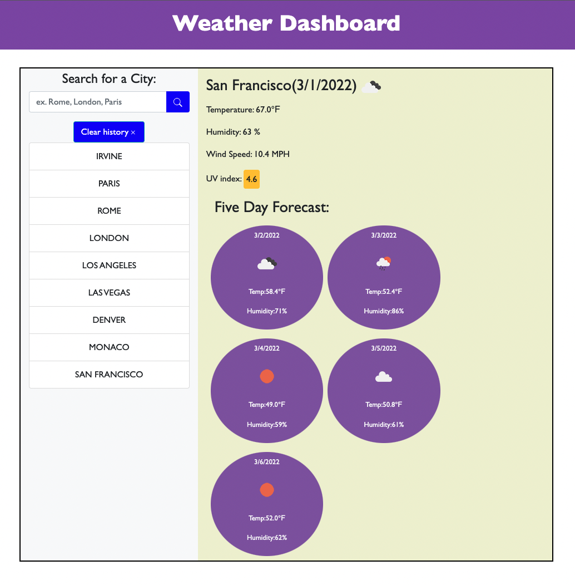

# WeatherDashboard
A simple weather application that utilizes the OpenWeatherMap API,
to retrieve weather data and make it available to the user. Once
the user has entered a search term, then they are given todays
weather info for that city, along with a five day forecast. Each
search is saved to `localStorage` and they are all viewable on the
side of the page. Additionally, dependant on the strength of the UV
index in any particular city, the UV index symbol will change color
accordingly. 

[Deployed Site](https://st12345678910.github.io/WeatherDashboard/)
 

